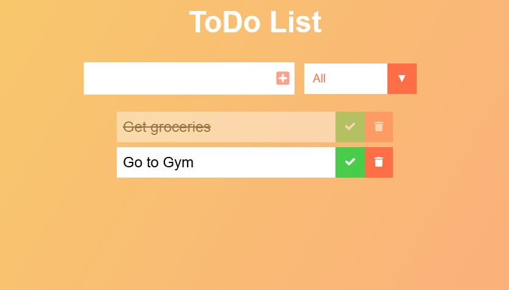

# ✅ ToDo List Application

🔗 [App](https://alexbalak21.github.io/Todo-List/)

A simple, clean, and efficient ToDo List application built with vanilla JavaScript, HTML, and CSS. The application allows you to add, complete, and delete tasks, with all data persisted in the browser's localStorage.



## Features

- **Add Tasks**: Quickly add new tasks to your list
- **Mark as Complete**: Check off completed tasks
- **Delete Tasks**: Remove tasks you no longer need
- **Filter Tasks**: View all, completed, or uncompleted tasks
- **Responsive Design**: Works on both desktop and mobile devices
- **Local Storage**: Your tasks are saved in your browser

## Technologies Used

- HTML5
- CSS3 (with CSS Variables for theming)
- Vanilla JavaScript (ES6+)
- Font Awesome Icons

<!-- ## Getting Started

1. Clone the repository:
   ```bash
   git clone [https://github.com/yourusername/todo-list.git](https://github.com/yourusername/todo-list.git) -->
